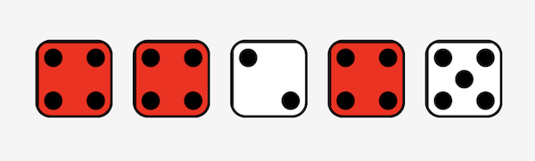
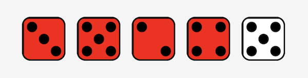

# Yahtzee-Unit-Project #

https://hammer-yahtzee.netlify.app/

## History ##

Yahtzee is a dice game of chance! It was originally produced by Milton Bradley (since acquired by Hasboro) in the early 1940's; it is said that the game originated from a couple that invented it to entertain guests on their yacht, refering to it as the "yacht game". Originally marketed as Yatzie, it was rebranded to Yahtzee in 1956. Yahtzee shares many similarities to the Scandinavian game Yatzy. Hasboro claims to now sell about 50 million copies of yahtzee each year.

As a family favorite game, it felt only natural to create an on-the-go version that did not require materials or a tabletop.

## Rules ##

Each turn consists of a maximum of three rolls. The first roll must be made with all five dice. If the player chooses to roll a second and, if desired, a third time, he may "hold" any or all the dice and roll again. A score must be entered after the last roll in the appropriate box or a zero entered in a box of the player’s choice. The player may also elect to enter a score in a box after either their first or second roll, at which point their turn would end and the next player would be up. Boxes may only be scored in once during the game and may not be changed once used. The game ends once each player has had 13 turns.

#### Holding dice ####
This may be achieved by clicking the dice the player wants to hold. This will turn the dice red and it will not roll until unclicked or it is the next player's turn.

#### Upper Section ####
In the Upper Section there are boxes to score “Aces,” “Twos,” “Threes,” “Fours”, “Fives” and “Sixes.” If a player chooses to score in the Upper Section, he counts and adds only the dice with the same number and enters the total of these dice in the appropriate box.

#### BONUS ####
To earn a bonus of 35 points, a player must score 63 points or more in the Upper Section. For quick calculation, 63 may be reached by scoring 3 “Aces,” “Twos,” and so on through “Sixes,” though it may be obtained by any combination.

#### 3 & 4 of a Kind ####
A player scores the total of all dice provided they include 3 of 4 dice of the same number, respectively. 

3 of a kind: 

4 of a kind: 

#### Full House #### 
A player may score 25 points in the Full House box any time they have a combination of 3 of one dice and 2 of another. An example would be 2 fours and 3 sixes.

Full House: 

#### Small and Large Straight ####
A player may score 30 points in their Sm Straight if they have a combination of dice that make up a sequence of four. the order and fifth dice does not matter. Examples include Ace, Two, Three, Four, (last dice doesn't matter), or Three, Four, Five, Six. 

Sm Straight: 

A player may score 40 points in their Lg Straight if they have a combination of dice that make up a sequence of five.

Lg Straight: 

### Yahtzee!! ###
A player may score 50 points in their Yahtzee if they have any five of a kind. They may also get up and yell "Yahtzee!!" and do a dance. 

Yahtzee: 

#### Chance ####
A player may score the total of all of their current dice at any point in the Chance box.

#### Yahtzee Bonus ####
A player may score 100 each time they have a five of a kind and they have already scored 50 in their "Yahtzee" box during the current game. This is the only box that may be achieved multiple times. (this will cause the player to have an empty box on their scoreboard for each time this is achieved).

### Tech Used ###
JavaScript
CSS
HTML

Shoutout to Bootstrap and Animate.css for buttons and (most) animations

### Future Endeavors ###
* Tracking player scores across multiple games
* Ability to add or remove players
* Computer logic?